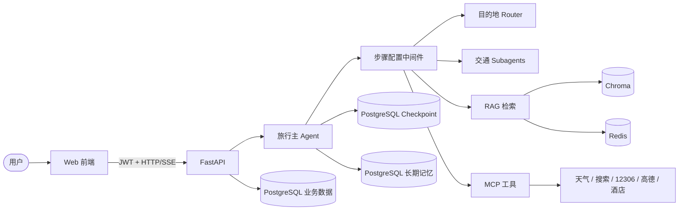

# 知行 Zhixing

> 一个基于 LangGraph、RAG 与 MCP 的多智能体旅行规划助手。

[](https://www.python.org/)
[](https://fastapi.tiangolo.com/)
[](https://docs.langchain.com/oss/python/langgraph/overview)
[](https://docs.docker.com/compose/)

知行将旅行需求收集、目的地推荐、交通规划、住宿与餐饮建议、行程生成、预算汇总和订单生成串成一条可回退、可持久化的对话流程。系统通过 FastAPI 提供 JWT 鉴权和 SSE 流式对话，使用 PostgreSQL 保存业务数据、Agent 状态与长期记忆，并通过 RAG 和 MCP 接入目的地知识、天气、搜索、12306、高德地图等能力。

> [!IMPORTANT]
> 项目目前处于早期开发阶段，适合学习、二次开发和本地体验。天气、航班、订单及部分行程/预算逻辑仍包含模拟或占位实现，不应直接用于真实预订或生产决策。

## 功能特性

- 八阶段旅行规划：需求 → 目的地 → 交通 → 住宿 → 餐饮 → 行程 → 预算 → 订单
- 状态可回退：修改前置选择时自动清理受影响的后续状态
- 多智能体协作：目的地 Router、交通协调 Agent、高铁与自驾 Subagent
- 混合 RAG：Multi-Query、BM25、Chroma 向量检索、RRF 融合和 Redis 缓存
- MCP 工具接入：本地天气/搜索服务、12306、高德地图和酒店服务
- 三层持久化：业务数据、LangGraph Checkpoint、跨会话长期记忆
- 完整 Web 链路：JWT 鉴权、会话管理、SSE 流式输出、单页前端
- Docker Compose 部署：PostgreSQL/pgvector、Redis、后端与 Nginx 前端

## 系统架构



核心流程并非八个独立 Agent 依次接力，而是同一个旅行主 Agent 根据 `current_step` 动态切换提示词和可用工具；目的地与交通任务会进一步分派给 Router 或 Subagent。

更详细的实现说明见 [`docs/zhixing项目整体流转梳理.md`](docs/zhixing项目整体流转梳理.md)。

## 快速开始：Docker Compose

### 1. 准备环境

- [Git](https://git-scm.com/)
- [Docker Desktop](https://www.docker.com/products/docker-desktop/) 或 Docker Engine + Compose v2
- 可用的 OpenAI 兼容模型服务
- DashScope API Key（当前 RAG Embedding 使用 `text-embedding-v3`）

克隆仓库并进入目录：

```bash
git clone <YOUR_REPOSITORY_URL>
cd zhixing
```

### 2. 创建 `.env`

在项目根目录新建 `.env`：

```dotenv
# 应用
APP_ENV=production
APP_HOST=0.0.0.0
APP_PORT=8000
DEBUG=false

# 主模型：推荐使用阿里云百炼的 OpenAI 兼容接口
LLM_API_KEY=your_dashscope_api_key
MODEL_NAME=qwen-plus
BASE_URL=https://dashscope.aliyuncs.com/compatible-mode/v1

# 查询改写/重排模型
RERANK_API_KEY=your_dashscope_api_key
RERANK_MODEL=qwen-turbo

# LangSmith；当前配置模型要求这些字段存在
LANGSMITH_API_KEY=your_langsmith_api_key
LANGSMITH_PROJECT=zhixing
LANGSMITH_TRACING=false
LANGSMITH_ENDPOINT=https://api.smith.langchain.com

# Docker Compose 内部服务名，不要改成 localhost
POSTGRES_HOST=postgres
POSTGRES_PORT=5432
POSTGRES_DB=zhixing
POSTGRES_USER=zhixing
POSTGRES_PASSWORD=replace_with_a_strong_password

REDIS_HOST=redis
REDIS_PORT=6379
REDIS_DB=0
REDIS_PASSWORD=

# 可选外部能力；不使用时可留空
AMAP_API_KEY=
TAVILY_API_KEY=
AIGOHOTEL_MCP_API=
```

> [!NOTE]
> `LLM_API_KEY` 同时被当前实现用于 DashScope Embedding。若主模型改用其他厂商，请同步调整 `app/rag/vectorstore.py` 的 Embedding 实现，或确保该密钥仍可调用 DashScope。`BASE_URL` 也会被主模型、查询改写模型和重排模型共用。

### 3. 构建并启动

```bash
docker compose config
docker compose up --build -d
docker compose ps -a
```

首次启动会下载镜像和依赖，并编译内置的 12306 MCP 服务。理想状态如下：

```text
zhixing-postgres   Up (healthy)
zhixing-redis      Up (healthy)
zhixing-init-db    Exited (0)
zhixing-backend    Up (healthy)
zhixing-frontend   Up
```

`init-db` 退出码为 `0` 表示数据库初始化成功。

### 4. 访问服务

| 服务             | 地址                                                    |
| ---------------- | ------------------------------------------------------- |
| Web 前端         | [http://localhost:8080](http://localhost:8080)             |
| 后端健康检查     | [http://localhost:8000/](http://localhost:8000/)           |
| Swagger API 文档 | [http://localhost:8000/docs](http://localhost:8000/docs)   |
| ReDoc            | [http://localhost:8000/redoc](http://localhost:8000/redoc) |

进入前端后，依次注册账号、新建会话并发送旅行需求即可开始体验。

## 常用运维命令

```bash
# 查看服务状态
docker compose ps -a

# 查看后端实时日志
docker compose logs -f backend

# 查看数据库初始化日志
docker compose logs init-db

# 停止服务并保留数据
docker compose down

# 修改代码后重新构建
docker compose up --build -d
```

> [!WARNING]
> `docker compose down -v` 会删除 PostgreSQL 和 Redis 的命名卷。除非确定不再需要数据，否则不要执行。

## 本地开发

### 环境要求

- Python 3.11+（Docker 镜像使用 Python 3.12）
- [uv](https://docs.astral.sh/uv/)
- Node.js 18+
- PostgreSQL 16 + pgvector
- Redis 7+

本地 `.env` 中的 `POSTGRES_HOST` 和 `REDIS_HOST` 通常应设为 `localhost`。随后执行：

```bash
# 安装锁定的 Python 依赖
uv sync --locked

# 安装并编译本地 12306 MCP
cd app/mcp_core/12306-mcp
npm ci
npm run build
cd ../../..

# 初始化业务表、LangGraph 表和 pgvector
uv run python scripts/init_db.py

# 启动后端
uv run uvicorn app.main:app --host 0.0.0.0 --port 8000
```

Windows 下如遇异步事件循环兼容问题，可改用：

```powershell
uv run python app/run.py
```

另开终端启动静态前端：

```bash
uv run python -m http.server 8080 --directory frontend
```

## API 概览

除注册和登录外，其余接口需在请求头中携带：

```http
Authorization: Bearer <access_token>
```

| 方法                 | 路径                                       | 说明                   |
| -------------------- | ------------------------------------------ | ---------------------- |
| `POST`             | `/api/v1/users/register`                 | 注册并获取 JWT         |
| `POST`             | `/api/v1/users/login`                    | 登录并获取 JWT         |
| `GET`              | `/api/v1/users/me`                       | 获取当前用户           |
| `POST`             | `/api/v1/conversations`                  | 创建会话               |
| `GET`              | `/api/v1/conversations`                  | 获取会话列表           |
| `GET/PATCH/DELETE` | `/api/v1/conversations/{id}`             | 查询、修改或软删除会话 |
| `POST`             | `/api/v1/chat/stream/{conversation_id}`  | SSE 流式对话           |
| `GET`              | `/api/v1/chat/history/{conversation_id}` | 获取聊天记录           |

完整请求结构和在线调试请使用 Swagger：[http://localhost:8000/docs](http://localhost:8000/docs)。

## 项目结构

```text
zhixing/
├── app/
│   ├── api/v1/              # 用户、会话和聊天 API
│   ├── agents/              # 主 Agent、Router 与 Subagents
│   ├── core/                # 状态、中间件、Checkpoint 与 Store
│   ├── mcp_core/            # MCP 客户端、自建服务与 12306 MCP
│   ├── models/              # SQLAlchemy 模型
│   ├── rag/                 # 文档处理、检索、融合、重排与缓存
│   ├── schemas/             # Pydantic 请求/响应模型
│   ├── tools/               # 状态、RAG、MCP 与记忆工具
│   ├── config.py            # 环境配置
│   └── main.py              # FastAPI 入口
├── data/                    # 知识文档与 Chroma 数据
├── docs/                    # 项目文档
├── frontend/zhixing.html    # 单文件 Web 前端
├── scripts/                 # 数据库、RAG 与维护脚本
├── tests/                   # 单元和集成测试
├── docker-compose.yml
├── Dockerfile
├── pyproject.toml
└── uv.lock
```

## 测试

```bash
uv run pytest -q
```

部分测试会访问模型、数据库、MCP 或第三方服务，运行前请准备对应环境变量和依赖服务。提交代码时请避免在测试输出、日志或样例文件中泄露真实密钥。

## 当前限制与路线图

- [ ] 将天气 Agent 从模拟数据切换为完整实时查询
- [ ] 接入真实航班检索，并纳入交通协调 Agent
- [ ] 将行程、预算和订单从占位生成升级为真实查询结果的结构化沉淀
- [ ] 解耦主模型、Embedding 和 Rerank 的供应商配置
- [ ] 增加权限、限流、输入校验和可观测性，完善生产安全配置
- [ ] 为前后端增加更完整的自动化测试和 CI

## 安全说明

- 不要提交 `.env`、日志、数据库备份或任何真实 API Key；仓库已通过 `.gitignore` 忽略 `.env`。
- 公网部署前请将 `allow_origins=["*"]` 改为明确的前端域名。
- 当前 JWT 签名复用了 `LLM_API_KEY`，生产环境应增加独立的 `JWT_SECRET_KEY` 配置。
- 请为 PostgreSQL 使用强密码，并通过反向代理启用 HTTPS、访问控制和速率限制。
- 本项目生成的路线、票务、价格和订单信息仅供参考，请以官方渠道为准。

如发现安全问题，请通过私密渠道联系维护者，不要在公开 Issue 中披露密钥或可利用细节。

## 参与贡献

欢迎提交 Issue 和 Pull Request。建议流程：

1. Fork 本仓库并创建功能分支。
2. 完成修改并补充相应测试与文档。
3. 确认未提交密钥、缓存、日志或本地数据。
4. 提交 Pull Request，说明改动动机、验证方式和潜在影响。

## 致谢

- [LangChain / LangGraph](https://github.com/langchain-ai/langgraph)
- [FastAPI](https://github.com/fastapi/fastapi)
- [Joooook/12306-mcp](https://github.com/Joooook/12306-mcp)（仓库内集成的 12306 MCP 服务，MIT License）
